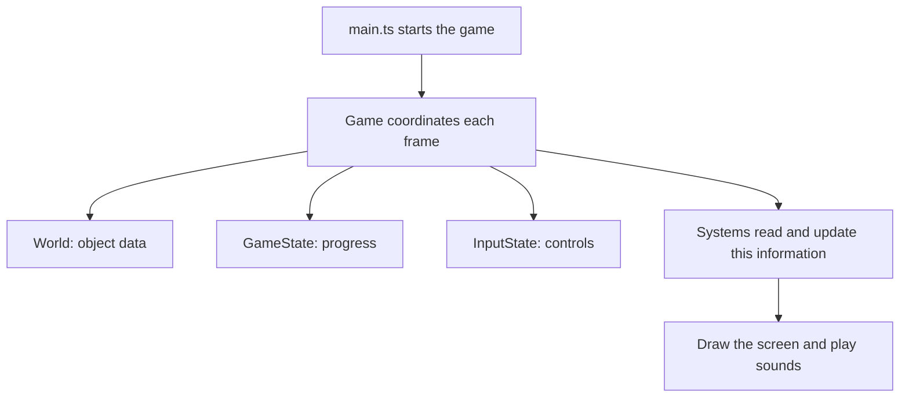
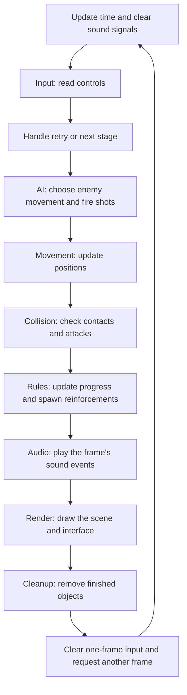
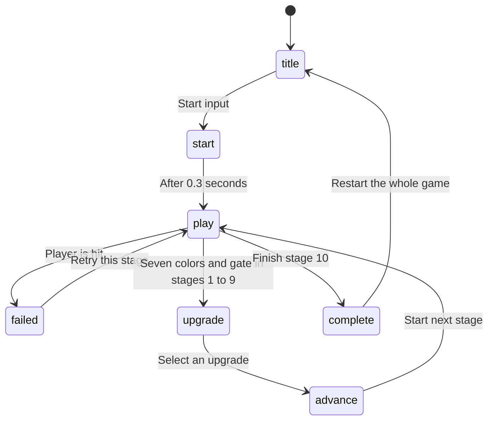

# How the Game Code Works

[🇺🇸 English](ARCHITECTURE.md) | [🇰🇷 한국어](documents/ko/ARCHITECTURE.md) | [🇯🇵 日本語](documents/ja/ARCHITECTURE.md) | [🇨🇳 简体中文](documents/zh/ARCHITECTURE.md)

The game separates **objects, their data, and the code that acts on them**. This organization is called ECS: Entity, Component, System.

You can understand it as a set of shared lists. One list says where objects are. Another says how fast they move. Different parts of the code update those lists and draw the result.

## 1. ECS with a simple example

Imagine a unicorn and a fireball:

| Object ID | What it is | Position | Movement |
|---|---|---|---|
| 0 | Unicorn | x: 100, y: 200 | Right at 260px/s |
| 1 | Fireball | x: 400, y: 200 | Left at 250px/s |

These are example values, not the actual starting positions.

Both objects need to move. Instead of writing separate movement code for each kind, one routine reads their positions and speeds and moves both.

That gives us the three ECS terms:

| Term | Plain meaning | In this game |
|---|---|---|
| Entity | An object's ID number | The number identifying a unicorn, enemy, or projectile |
| Component | One piece of information about an object | Position, speed, health, or remaining lifetime |
| System | Code that does one group of jobs | Move objects, check collisions, or draw the screen |

**An entity does not move itself. A system changes its position data.**

## 2. World stores the objects' information

`World` is the shared container for these lists. The code uses a JavaScript `Map`, which lets it look up a value by ID:

```ts
// Read the position belonging to this object.
const position = world.positions.get(entity);

// Read its movement speed.
const velocity = world.velocities.get(entity);
```

A `Set` is a list of IDs without extra information. For example, `world.players` identifies which object is the player. This membership is called a **tag**.

To make a player, `spawnPlayer()` creates an ID and attaches the information it needs:

```ts
const entity = world.createEntity();
world.positions.set(entity, {x: 1600, y: 1100});
world.velocities.set(entity, {x: 0, y: 0});
world.facings.set(entity, {x: 1, y: 0});
world.cooldowns.set(entity, {value: 0});
world.radii.set(entity, {value: 11});
world.players.add(entity);
```

Here, facing means the direction it looks, cooldown is a waiting timer, and radius is the size of its collision circle. An enemy is made in the same way, with enemy type and health data added instead of the player tag. These object-making functions live in `src/prefabs.ts`.

TypeScript helps check the shape of the data. Its special `Entity` type also helps distinguish object IDs from ordinary numbers while editing the code.

## 3. Game coordinates everything

There are three important containers to distinguish:

| Container | What it remembers | Example |
|---|---|---|
| `World` | Individual objects | An enemy's position and health |
| `GameState` | Progress of the whole run | Current stage, collected colors, upgrades, total time |
| `InputState` | What the user is pressing | Right arrow held, attack just pressed, joystick direction |

`Game` owns these containers and calls the systems in order. `main.ts` creates `Game` and asks the browser to start drawing frames.



## 4. What happens when you press Right?

A **frame** is one update of the game and screen. The browser repeatedly calls `Game.frame()` through `requestAnimationFrame`.

1. `InputState` remembers that Right is held.
2. `InputSystem` sets the unicorn's movement to the right.
3. `MovementSystem` adds that movement to its position.
4. `CollisionSystem` checks whether its new position touches something.
5. `RulesSystem` updates game progress if needed.
6. `RenderSystem` reads the position and draws the unicorn there.

Movement uses time since the last frame:

```text
new position = old position + speed × elapsed seconds
```

At 260px/s, a 0.01-second update moves the unicorn 2.6px. The renderer rounds drawing positions to keep the picture crisp; the stored position can still contain a fraction.

## 5. The order of work in one frame



Each system has a main job:

| System | Question it answers |
|---|---|
| `InputSystem` | What does the player want to do? |
| `AISystem` | Where should enemies go, and is it time to fire? |
| `MovementSystem` | Where are moving objects now? |
| `CollisionSystem` | What touched what, and what did an attack hit? |
| `RulesSystem` | Did the player lose, open the gate, or finish a stage? Is reinforcement due? |
| `AudioSystem` | Which sounds should play? |
| `RenderSystem` | What should the player see? |
| `CleanupSystem` | Which objects should be removed? |

Some jobs share a system: AI also fires the unicorn's automatic bolts, and Collision applies the wave's push. Follow the actual function when studying a behavior, rather than relying only on the system name.

Order matters. A shot created in AI can move and hit something in the same frame. An enemy created later by Rules is drawn immediately but starts its AI movement on the next frame.

## 6. What happens when a prism is collected?

This is another useful way to follow the code:

1. **Collision** finds the overlap between unicorn and prism and reports the prism's color.
2. **Rules** adds that color to the collected colors and increases the count.
3. **Audio** plays the collection sound, using a signal set by `Game` from the collision result.
4. **Render** draws the updated color display.
5. **Cleanup** removes the collected prism.

With Rainbow Wave unlocked, there is an extra step: the prism becomes a temporary wave instead of disappearing immediately. It keeps its color, moves to the activation position, and gets a 0.6-second lifetime. Collision applies the push, Render draws the expanding circle, and Cleanup removes it when its life ends.

The drawing code does not decide whether a prism was collected. It displays the result that the other systems have already calculated.

## 7. How does an object disappear safely?

A destroyed enemy or expired projectile is usually added to `world.consumed`: a list meaning **remove this object**.

At the end of the frame, `CleanupSystem` calls `World.destroyEntity()`. That removes the ID from every registered list, including positions, speeds, and cooldowns. Removing only its picture would leave invisible game data behind.

Starting a stage calls `World.clear()` to empty all object lists and reset the ID counter. IDs are reused after this reset, so an old ID should not be treated as the same object in the next stage.

## 8. Screens and stages are controlled by a state

`GameState.phase` tells the game what is happening now: title, play, upgrade selection, failure, or completion. There are also two short transition states.



Three functions in `Game` manage the main transitions:

| Function | What it does |
|---|---|
| `reset()` | Create a fresh run and show the title |
| `startStage()` | Replace the arena objects and reset stage-local progress |
| `nextStage()` | Increase the stage number and call `startStage()` |

A retry keeps upgrades and total playing time. A whole-run reset clears them. Each stage begins with one second of protection from damage.

The total timer advances during play, including failed attempts. It pauses on upgrade and failure screens. Each cleared stage's time is the total minus the times already assigned to earlier stages.

Two details matter when reading the code:

- One frame can advance time by at most 0.05 seconds. A long browser stall therefore does not count as its full real-world duration.
- Pausing is handled inside systems. Movement still runs outside play, so enemies or shots with remaining velocity can move behind an overlay, even though collision gameplay and the main timer are paused.

## 9. Where should you start reading?

```text
src/
  main.ts                 Starts the game
  game.ts                 Runs frames and changes stages
  state.ts                Defines run progress and settings
  input.ts                Stores keyboard and touch input
  prefabs.ts              Creates game objects
  ecs/
    entity.ts             Defines object IDs
    component.ts          Defines data-list types
    world.ts              Holds and cleans up those lists
  systems/                Movement, AI, collision, rules, audio, drawing...
  assets/                 Character and gate images

tools/
  build-game.mjs          Combines the game into one HTML file
  build-zip.mjs           Makes the submission ZIP
  build-dashboard.mjs     Makes the local inspection dashboard
```

A useful reading order is **prefabs → World → Game.frame → Movement → Collision → Rules → Render**. Follow one object, such as a prism, through those files.

The build combines the source files, removes development-only code, shortens internal names, and embeds the WebP images into `index.html`. The ZIP contains that HTML. The folders above make development easier; they do not become a matching set of files inside the submission.

For how the pictures, animation, sounds, and enemy movement are made, see [TECHNIQUES.md](TECHNIQUES.md).
