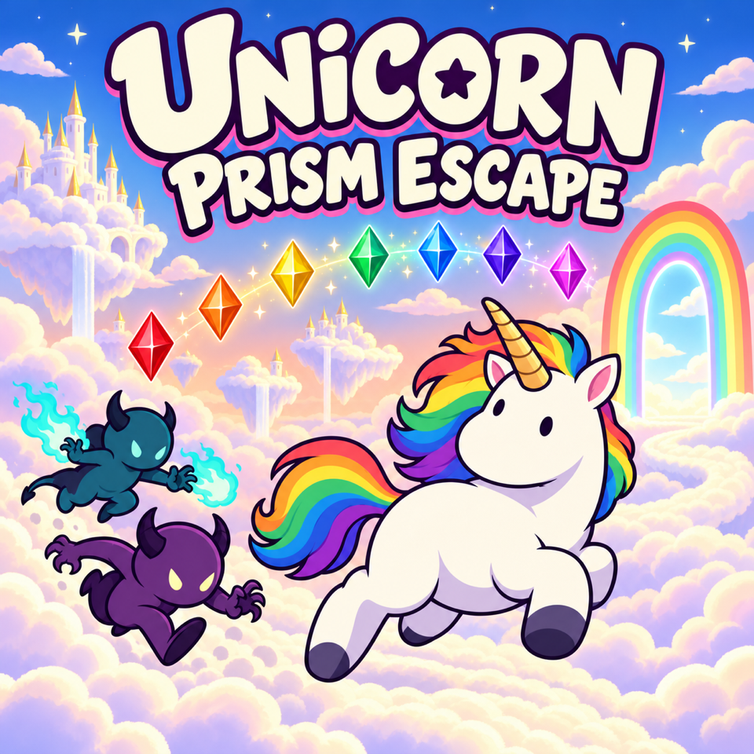

# Unicorn Prism Escape



A colorful survival game set high above the clouds. Guide a rainbow-maned unicorn past pursuing demons, collect all seven prism colors in each stage, and escape through the rainbow gate.

Clear all 10 stages to win. Your total time carries across stages and retries, but pauses while you choose upgrades.

## Controls

- **Move:** WASD or arrow keys. On touchscreens, hold and drag the joystick in the bottom-left corner.
- **Start:** Space, Enter, or tap the title screen.
- **Attack:** Space or the attack button, once unlocked.
- **Choose upgrades:** WASD or arrow keys, then Space to confirm. With touch or mouse, select an upgrade and tap it again to confirm.
- **Retry:** R or tap after defeat. After completing the game, R or tap starts a new run.
- **Mute / unmute:** M.

## Upgrades

Choose an upgrade between stages. Each row unlocks in order:

- **Map:** Gate Map shows your position and the gate; Prism Map adds remaining prisms; Enemy Sense adds enemies.
- **Attack:** Rainbow Horn strikes ahead; Rainbow Bolt automatically fires lightning in four directions; Rainbow Wave pushes enemies away and clears nearby enemy shots when you collect a prism.
- **Ability:** Speed Up helps you move faster; Prism Magnet pulls nearby prisms toward you; Slow Aura slows nearby enemies and their shots.

## Run locally

```sh
npm install
npm run dev
```

Open http://localhost:8080. Use `npm run zip` to build the standalone game archive.
