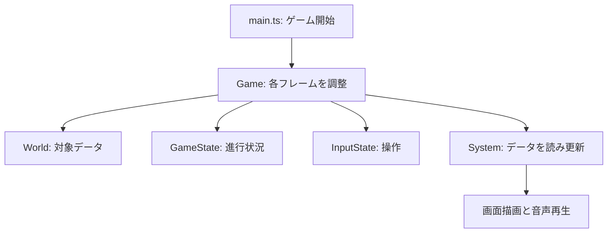
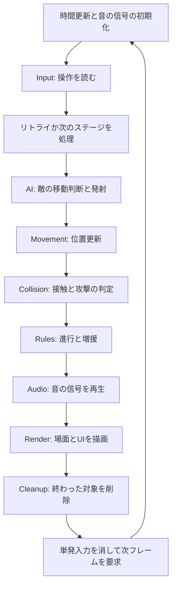
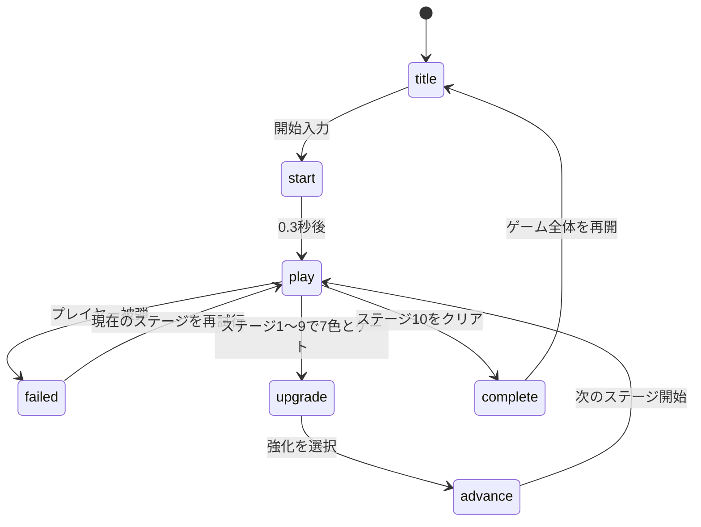

# ゲームのコードはどう動くのか

[🇺🇸 English](../../ARCHITECTURE.md) | [🇰🇷 한국어](../ko/ARCHITECTURE.md) | [🇯🇵 日本語](ARCHITECTURE.md) | [🇨🇳 简体中文](../zh/ARCHITECTURE.md)

このゲームは、**ゲーム内の対象、そのデータ、データを処理するコード**を分けています。これをECS（Entity・Component・System）と呼びます。

共有する一覧があると考えると理解しやすくなります。ある一覧は位置、別の一覧は移動速度を持ちます。各処理が一覧を書き換え、その結果を画面に描きます。

## 1. 簡単な例で理解するECS

ユニコーンと火の玉を考えてみましょう。

| 対象ID | 種類 | 位置 | 移動 |
|---|---|---|---|
| 0 | ユニコーン | x: 100, y: 200 | 右へ260px/s |
| 1 | 火の玉 | x: 400, y: 200 | 左へ250px/s |

これは説明用の値で、実際の開始位置ではありません。

どちらも移動が必要です。種類ごとに別の移動処理を書く代わりに、同じ処理が位置と速度を読み、両方を動かします。

| 用語 | 簡単な意味 | このゲームの例 |
|---|---|---|
| Entity | 対象を識別するID番号 | ユニコーン、敵、弾の番号 |
| Component | 対象についての情報の一部 | 位置、速度、体力、残り寿命 |
| System | ひとまとまりの仕事をするコード | 移動、衝突判定、画面描画 |

**Entityが自分で動くのではなく、Systemが位置データを書き換えます。**

## 2. Worldが対象の情報を保存する

`World`は一覧をまとめた共有の入れ物です。JavaScriptの`Map`でIDに対応する値を取得します。

```ts
// この対象の位置を取得する。
const position = world.positions.get(entity);
// 移動速度を取得する。
const velocity = world.velocities.get(entity);
```

`Set`は追加データを持たないIDの集合です。例えば`world.players`はプレイヤーに該当する対象を示します。この分類を**タグ**と呼びます。

`spawnPlayer()`はIDを作り、必要な情報を付けてプレイヤーを生成します。

```ts
const entity = world.createEntity();
world.positions.set(entity, {x: 1600, y: 1100});
world.velocities.set(entity, {x: 0, y: 0});
world.facings.set(entity, {x: 1, y: 0});
world.cooldowns.set(entity, {value: 0});
world.radii.set(entity, {value: 11});
world.players.add(entity);
```

facingは向き、cooldownは待ち時間、radiusは当たり判定の円の半径です。敵も同じ方法で作り、プレイヤータグの代わりに敵の種類と体力を付けます。生成関数は`src/prefabs.ts`にあります。

TypeScriptはデータの形を検査します。専用の`Entity`型は、コードを書く際に対象IDと普通の数値を区別する助けにもなります。

## 3. Gameが全体を調整する

次の3つの入れ物を区別しましょう。

| 入れ物 | 保存するもの | 例 |
|---|---|---|
| `World` | 個々の対象 | 敵1体の位置と体力 |
| `GameState` | 1回のプレイ全体の進行 | ステージ、収集色、強化、合計時間 |
| `InputState` | ユーザーの入力 | 右キーを押し続ける、攻撃を押した瞬間、ジョイスティックの方向 |

`Game`はこれらを所有し、Systemを順番に呼びます。`main.ts`がGameを生成し、ブラウザーにフレーム実行の開始を依頼します。



## 4. 右キーを押すと何が起きるのか

**フレーム**はゲームと画面を1回更新する処理です。ブラウザーが`requestAnimationFrame`を通じて`Game.frame()`を繰り返し呼びます。

1. `InputState`が右キーを押していることを覚えます。
2. `InputSystem`がユニコーンの速度を右方向に設定します。
3. `MovementSystem`が速度に応じて位置を変えます。
4. `CollisionSystem`が新しい位置で何かに触れたか調べます。
5. `RulesSystem`が必要に応じて進行状況を更新します。
6. `RenderSystem`が位置を読み、そこにユニコーンを描きます。

移動量には前のフレームからの経過時間を使います。

```text
新しい位置 = 元の位置 + 速度 × 経過秒数
```

260px/sで0.01秒なら2.6px移動します。位置データには小数を保存できますが、描画位置は丸めて絵の鮮明さを保ちます。

## 5. 1フレーム内の作業順序



| System | 答える問い |
|---|---|
| `InputSystem` | プレイヤーは何をしたいか？ |
| `AISystem` | 敵はどこへ向かうか？ 発射する時刻か？ |
| `MovementSystem` | 動く対象の現在位置はどこか？ |
| `CollisionSystem` | 何と何が触れ、攻撃は何に当たったか？ |
| `RulesSystem` | 敗北、ゲート開放、クリア、増援の条件を満たしたか？ |
| `AudioSystem` | どの音を鳴らすか？ |
| `RenderSystem` | 何を画面に見せるか？ |
| `CleanupSystem` | どの対象を削除するか？ |

複数の仕事を同じSystemが担当する場合もあります。AIはユニコーンの自動弾も発射し、Collisionは波動の押し戻しも行います。名前だけでなく実際の関数を追って理解しましょう。

順序には意味があります。AIで作った弾は同じフレームで移動し命中できます。後段のRulesで生成した増援はすぐ描画されますが、AIによる移動は次のフレームからです。

## 6. プリズムを集めると何が起きるのか

別の例で処理を追ってみましょう。

1. **Collision**がユニコーンとプリズムの重なりを検出し、色を報告します。
2. **Rules**が収集色に加え、個数を増やします。
3. **Audio**が衝突結果からGameの設定した信号で収集音を鳴らします。
4. **Render**が更新された色の表示を描きます。
5. **Cleanup**が収集済みプリズムを削除します。

Rainbow Waveがあれば、プリズムはすぐ消えず、一時的な波動になります。色を保持し、発動位置に移り、0.6秒の寿命を持ちます。Collisionが押し戻しを行い、Renderが広がる円を描き、寿命が終わるとCleanupが削除します。

描画コードは収集の成否を決めません。他のSystemが計算した結果を表示します。

## 7. 対象を安全に消すには

倒した敵や寿命が切れた弾は通常、`world.consumed`に登録します。意味は**この対象を削除する**です。

フレームの最後にCleanupSystemが`World.destroyEntity()`を呼び、位置、速度、待ち時間などすべての登録済み一覧からIDを消します。絵だけを消すと、見えないゲームデータが残ってしまいます。

ステージ開始時は`World.clear()`で全対象の一覧とIDカウンターを初期化します。IDは再利用されるので、次のステージの同じ番号を同じ対象だと思ってはいけません。

## 8. 状態で画面とステージを制御する

`GameState.phase`はタイトル、プレイ、強化選択、敗北、完了のどれにいるかを表します。短い遷移用の状態も2つあります。



Gameの主な遷移関数は3つです。

| 関数 | 処理 |
|---|---|
| `reset()` | 新しいプレイを作りタイトルを表示 |
| `startStage()` | マップの対象を入れ替え、ステージ内の進行を初期化 |
| `nextStage()` | ステージ番号を増やしstartStageを呼ぶ |

リトライは強化と合計プレイ時間を保持し、全体のリセットはそれらを消します。各ステージは1秒間ダメージを受けない状態で始まります。

合計時間は失敗した試行も含めプレイ中に増え、強化・敗北画面では止まります。クリアしたステージの時間は合計時間から、それまでに確定したステージ時間を引いた値です。

コードを読む際は次の2点も重要です。

- 1フレームで進める時間は最大0.05秒です。ブラウザーが長く停止しても、その実時間全体は加算されません。
- 一時停止は各Systemで処理します。Movementはプレイ外でも動くため、速度の残った敵や弾はオーバーレイの裏で移動できます。衝突のゲーム処理とメインタイマーは停止します。

## 9. どこから読み始めるとよいか

```text
src/
  main.ts                 ゲーム開始
  game.ts                 フレーム実行とステージ遷移
  state.ts                進行状況と設定
  input.ts                キーボード・タッチ入力の保存
  prefabs.ts              対象の生成
  ecs/
    entity.ts             対象IDの定義
    component.ts          データ一覧の型
    world.ts              一覧の保存と削除
  systems/                移動、AI、衝突、ルール、音声、描画
  assets/                 キャラクターとゲートの画像

tools/
  build-game.mjs          HTMLひとつにまとめる
  build-zip.mjs           提出ZIPを作る
  build-dashboard.mjs     ローカル確認用ダッシュボードを作る
```

**prefabs → World → Game.frame → Movement → Collision → Rules → Render**の順が読みやすいでしょう。プリズムなど1つの対象を各ファイルで追ってみてください。

ビルドはソースをまとめ、開発専用コードを除き、内部名を短縮してWebPをindex.htmlに埋め込みます。ZIPにはそのHTMLが入ります。上のフォルダー構造は開発用で、提出ZIPに同じ構造で保存されるわけではありません。

絵、アニメーション、音、敵の移動の作り方は[TECHNIQUES.md](TECHNIQUES.md)を参照してください。
