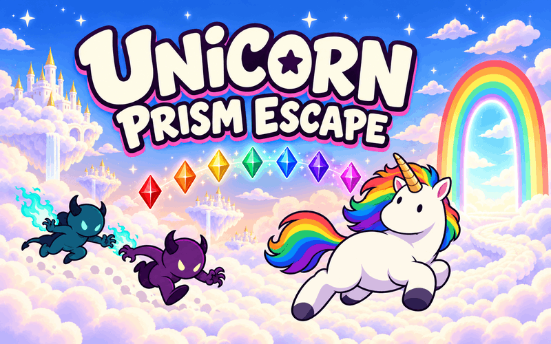

# Unicorn Prism Escape

[🇺🇸 English](../../README.md) | [🇰🇷 한국어](../ko/README.md) | [🇯🇵 日本語](README.md) | [🇨🇳 简体中文](../zh/README.md)

**js13kGames 2026 出品作品 — わずか13,309バイトに収めた完成したゲーム。**

**[js13kGamesでプレイ](https://js13kgames.com/2026/games/unicorn-prism-escape)**

提出ZIP：**13,309 / 13,312バイト**。

雲の上の空を舞台にした、カラフルなサバイバルゲームです。虹色のたてがみを持つユニコーンを操作して追いかけてくる悪魔をかわし、各ステージで7色のプリズムを集め、虹のゲートから脱出しましょう。

全10ステージをクリアすると勝利です。合計時間はステージやリトライをまたいで加算されますが、強化を選んでいる間は停止します。

## 操作方法

- **移動：** WASDまたは矢印キー。タッチ画面では左下のジョイスティックを押したままドラッグします。
- **開始：** Space、Enter、またはタイトル画面をタップ。
- **攻撃：** 解放後にSpaceまたは攻撃ボタン。
- **強化の選択：** WASDまたは矢印キーで選び、Spaceで確定します。タッチ・マウスでは項目を選び、もう一度タップして確定します。
- **リトライ：** 敗北後にRまたは画面をタップ。全ステージクリア後はRまたはタップで新しいゲームを始めます。
- **ミュート切り替え：** M。

## 強化

ステージ間で強化を1つ選びます。各行は順番に解放されます。

- **マップ：** Gate Mapは自分の位置とゲートを表示します。Prism Mapは残りのプリズム、Enemy Senseは敵の位置を追加します。
- **攻撃：** Rainbow Hornは前方を攻撃します。Rainbow Boltは4方向に自動で雷を放ちます。Rainbow Waveはプリズムを集めたときに周囲の敵を押し戻し、近くの敵弾を消します。
- **能力：** Speed Upは移動を速くし、Prism Magnetは近くのプリズムを引き寄せ、Slow Auraは近くの敵と敵弾を遅くします。

## 開発ドキュメント

- [アーキテクチャ](ARCHITECTURE.md) — ECS構造とゲームループの仕組みを説明します。
- [テクニック](TECHNIQUES.md) — 素材、アニメーション、音声、敵の追跡、レベルを13KBに収める方法を説明します。
