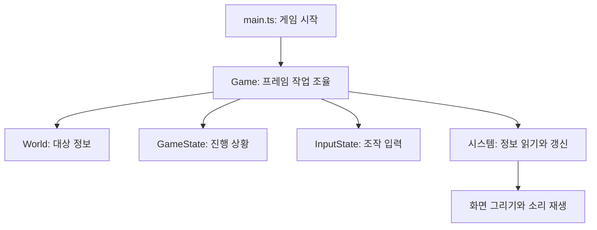
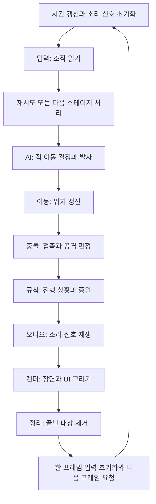
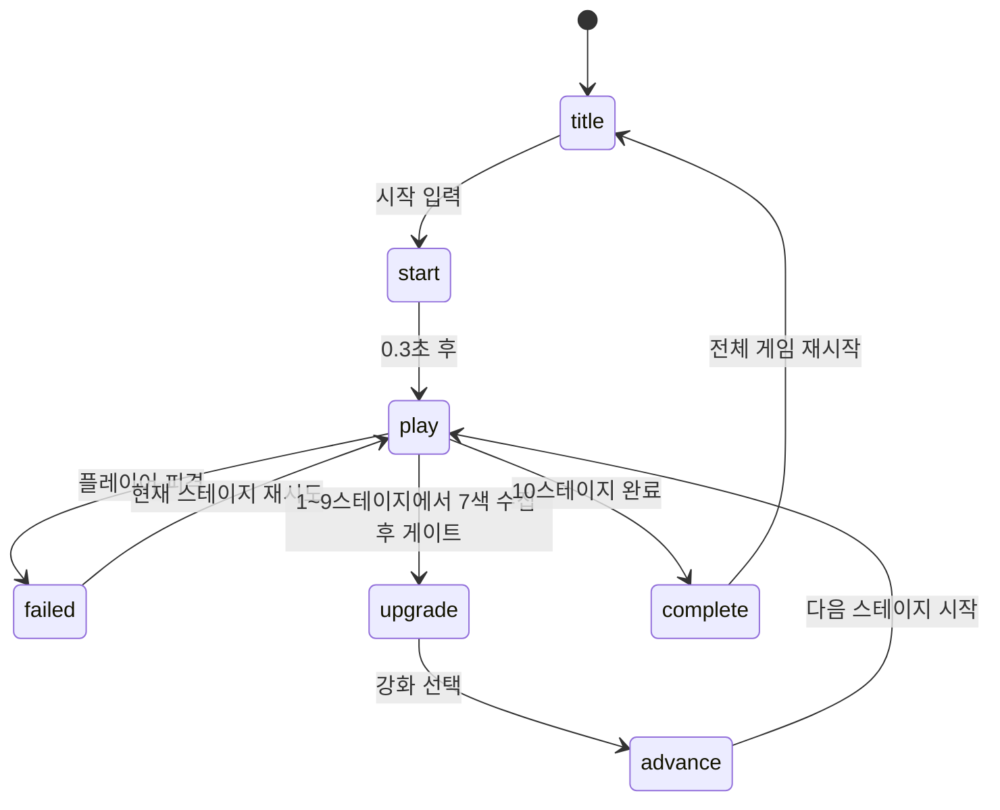

# 게임 코드는 어떻게 돌아가는가?

[🇺🇸 English](../../ARCHITECTURE.md) | [🇰🇷 한국어](ARCHITECTURE.md) | [🇯🇵 日本語](../ja/ARCHITECTURE.md) | [🇨🇳 简体中文](../zh/ARCHITECTURE.md)

이 게임은 **게임 속 대상, 대상의 정보, 그 정보를 처리하는 코드**를 나눠 관리한다. 이를 ECS, 즉 Entity·Component·System이라고 한다.

공유하는 목록들이 있다고 생각하면 쉽다. 어떤 목록에는 위치, 다른 목록에는 이동 속도가 있다. 여러 코드가 이 목록을 갱신하고 결과를 화면에 그린다.

## 1. 간단한 예시로 이해하는 ECS

유니콘과 불덩이가 있다고 생각해 보자.

| 대상 ID | 정체 | 위치 | 이동 |
|---|---|---|---|
| 0 | 유니콘 | x: 100, y: 200 | 오른쪽으로 초당 260px |
| 1 | 불덩이 | x: 400, y: 200 | 왼쪽으로 초당 250px |

이 표의 위치는 설명용 예시이며 실제 시작 위치는 아니다.

둘 다 움직여야 한다. 종류별로 이동 코드를 따로 쓰는 대신, 공통 코드 하나가 위치와 속도를 읽어 둘 다 이동시킨다.

| 용어 | 쉬운 뜻 | 게임 속 예 |
|---|---|---|
| Entity | 대상의 ID 번호 | 유니콘·적·탄환을 구분하는 번호 |
| Component | 대상에 관한 정보 하나 | 위치, 속도, 체력, 남은 수명 |
| System | 한 종류의 일을 맡는 코드 | 이동, 충돌 확인, 화면 그리기 |

**엔티티가 스스로 움직이는 것이 아니다. 시스템이 엔티티의 위치 데이터를 바꾼다.**

## 2. World는 대상들의 정보를 보관한다

`World`는 이 목록들을 담는 공용 보관함이다. JavaScript의 `Map`으로 ID에 해당하는 값을 찾는다.

```ts
// 이 대상의 위치를 가져온다.
const position = world.positions.get(entity);

// 이 대상의 이동 속도를 가져온다.
const velocity = world.velocities.get(entity);
```

추가 정보 없이 ID만 모을 때는 `Set`을 쓴다. `world.players`는 어떤 대상이 플레이어인지 표시하는 목록이다. 이런 분류 표시를 **태그**라고 한다.

`spawnPlayer()`는 ID를 만들고 필요한 정보를 붙여 플레이어를 만든다.

```ts
const entity = world.createEntity();
world.positions.set(entity, {x: 1600, y: 1100});
world.velocities.set(entity, {x: 0, y: 0});
world.facings.set(entity, {x: 1, y: 0});
world.cooldowns.set(entity, {value: 0});
world.radii.set(entity, {value: 11});
world.players.add(entity);
```

facing은 바라보는 방향, cooldown은 대기 시간, radius는 충돌 원의 반경이다. 적도 같은 방식으로 만들되 플레이어 태그 대신 적 종류와 체력 정보를 넣는다. 이런 생성 함수들은 `src/prefabs.ts`에 있다.

TypeScript는 데이터 형태를 검사한다. `Entity`라는 별도 타입으로 코드를 작성할 때 대상 ID와 일반 숫자의 혼동도 줄인다.

## 3. Game이 전체 작업을 조율한다

세 보관함을 구분하면 이해하기 쉽다.

| 보관함 | 기억하는 것 | 예시 |
|---|---|---|
| World | 개별 대상의 정보 | 적 하나의 위치와 체력 |
| GameState | 한 판 전체의 진행 | 스테이지, 수집 색상, 강화, 누적 시간 |
| InputState | 사용자가 누르는 입력 | 오른쪽 키 유지, 방금 공격 누름, 조이스틱 방향 |

`Game`이 이 보관함들을 가지고 시스템을 순서대로 호출한다. `main.ts`는 Game을 만들고 브라우저에 프레임 실행을 시작하도록 요청한다.



## 4. 오른쪽 키를 누르면 어떤 일이 일어나는가?

**프레임**은 게임과 화면을 한 번 갱신하는 작업이다. 브라우저는 `requestAnimationFrame`으로 `Game.frame()`을 반복 호출한다.

1. InputState가 오른쪽 키를 누르고 있음을 기억한다.
2. InputSystem이 유니콘의 속도를 오른쪽 방향으로 설정한다.
3. MovementSystem이 그 속도로 위치를 바꾼다.
4. CollisionSystem이 새 위치에서 무언가와 닿았는지 확인한다.
5. RulesSystem이 필요하면 진행 상황을 바꾼다.
6. RenderSystem이 위치를 읽고 그곳에 유니콘을 그린다.

이동량에는 직전 프레임 이후 흐른 시간을 사용한다.

```text
새 위치 = 기존 위치 + 속도 × 경과한 초
```

초당 260px로 움직일 때 0.01초가 지나면 2.6px 이동한다. 실제 위치 데이터에는 소수가 들어갈 수 있지만, 그릴 때는 반올림해 그림을 선명하게 유지한다.

## 5. 한 프레임의 작업 순서



| 시스템 | 답하는 질문 |
|---|---|
| InputSystem | 플레이어가 무엇을 하려는가? |
| AISystem | 적은 어디로 가야 하며 발사할 때가 되었는가? |
| MovementSystem | 움직이는 대상의 현재 위치는 어디인가? |
| CollisionSystem | 무엇끼리 닿았고 공격이 무엇을 맞혔는가? |
| RulesSystem | 실패·게이트 개방·클리어가 일어났는가? 증원할 때인가? |
| AudioSystem | 어떤 소리를 낼 것인가? |
| RenderSystem | 무엇을 화면에 보여줄 것인가? |
| CleanupSystem | 어떤 대상을 제거할 것인가? |

여러 일이 같은 시스템에 들어가기도 한다. AI는 유니콘의 자동 번개도 발사하고, Collision은 파동의 밀어내기도 수행한다. 기능을 공부할 때는 시스템 이름뿐 아니라 실제 함수를 따라가면 된다.

순서는 동작에 영향을 준다. AI에서 만든 탄환은 같은 프레임에 이동하고 명중할 수 있다. 그보다 뒤의 Rules에서 만든 증원 적은 바로 보이지만 AI 이동은 다음 프레임부터 시작한다.

## 6. 프리즘을 먹으면 어떤 일이 일어나는가?

다른 예시로 코드를 따라가 보자.

1. **Collision**이 유니콘과 프리즘의 겹침을 찾아 색상을 알려준다.
2. **Rules**가 수집한 색상에 추가하고 개수를 늘린다.
3. **Audio**가 충돌 결과를 받아 Game이 설정한 신호로 수집음을 재생한다.
4. **Render**가 갱신된 색상 표시를 그린다.
5. **Cleanup**이 먹은 프리즘을 제거한다.

Rainbow Wave가 있으면 프리즘을 바로 지우지 않고 임시 파동으로 바꾼다. 색상을 유지하고 발동 위치로 옮기며 0.6초 수명을 준다. Collision이 적을 밀고, Render가 퍼지는 원을 그리고, 수명이 끝나면 Cleanup이 제거한다.

그리는 코드가 프리즘 수집 여부를 결정하는 것은 아니다. 다른 시스템이 계산한 결과를 보여준다.

## 7. 대상을 어떻게 안전하게 지우는가?

죽은 적이나 수명이 끝난 탄환은 보통 `world.consumed`에 넣는다. 뜻은 **이 대상을 제거하라**다.

프레임 끝에 CleanupSystem이 `World.destroyEntity()`를 호출한다. 위치·속도·쿨다운을 포함한 모든 등록 목록에서 그 ID를 지운다. 그림만 지우면 화면에 안 보이는 게임 데이터가 남기 때문이다.

스테이지를 시작할 때는 `World.clear()`로 모든 대상 목록과 ID 카운터를 초기화한다. ID는 다시 사용되므로 다음 스테이지의 같은 번호를 이전 대상이라고 생각하면 안 된다.

## 8. 화면과 스테이지는 상태로 제어한다

`GameState.phase`는 현재 타이틀인지, 플레이 중인지, 강화 선택·실패·완료 상태인지 알려준다. 짧은 전환 상태 두 개도 있다.



Game의 주요 전환 함수는 세 개다.

| 함수 | 하는 일 |
|---|---|
| reset() | 새 한 판을 만들고 타이틀 표시 |
| startStage() | 맵의 대상을 교체하고 스테이지 진행 초기화 |
| nextStage() | 스테이지 번호를 올리고 startStage 호출 |

재시도는 강화와 누적 플레이 시간을 유지하고 전체 재시작은 지운다. 스테이지마다 시작 시 1초 동안 피해를 받지 않는다.

누적 시간은 실패한 시도를 포함한 플레이 중에 증가하고 강화·실패 화면에서는 멈춘다. 현재 스테이지 기록은 누적 시간에서 앞서 완료한 스테이지 시간을 뺀 값이다.

코드를 읽을 때 두 가지를 알아두면 좋다.

- 한 프레임에서 시간은 최대 0.05초만 증가한다. 브라우저가 오래 멈춰도 실제 경과시간 전체가 기록되는 것은 아니다.
- 일시정지는 시스템별로 처리한다. Movement는 플레이 밖에서도 실행되므로 적·탄환은 남은 속도로 오버레이 뒤에서 움직일 수 있다. 충돌 게임 처리와 메인 타이머는 멈춘다.

## 9. 어디부터 읽으면 좋은가?

```text
src/
  main.ts                 게임 시작
  game.ts                 프레임 실행과 스테이지 전환
  state.ts                진행 상황과 설정 정의
  input.ts                키보드·터치 입력 저장
  prefabs.ts              게임 대상 생성
  ecs/
    entity.ts             대상 ID 정의
    component.ts          데이터 목록 타입 정의
    world.ts              목록 보관과 정리
  systems/                이동·AI·충돌·규칙·오디오·그리기
  assets/                 캐릭터·게이트 이미지

tools/
  build-game.mjs          게임을 HTML 하나로 합치기
  build-zip.mjs           제출 ZIP 만들기
  build-dashboard.mjs     로컬 확인용 대시보드 만들기
```

**prefabs → World → Game.frame → Movement → Collision → Rules → Render** 순서로 읽으면 좋다. 프리즘 같은 대상 하나가 파일들을 거치며 어떻게 처리되는지 따라가면 된다.

빌드는 소스를 합치고 개발 전용 코드를 제거하며 내부 이름을 줄이고 WebP 이미지를 index.html 안에 넣는다. ZIP에는 이 HTML이 들어간다. 위 폴더 구조는 개발을 편하게 만들기 위한 것이며 제출 ZIP에 그대로 들어가는 구조는 아니다.

그림·애니메이션·소리·적 움직임을 만드는 방법은 [TECHNIQUES.md](TECHNIQUES.md)에 있다.
