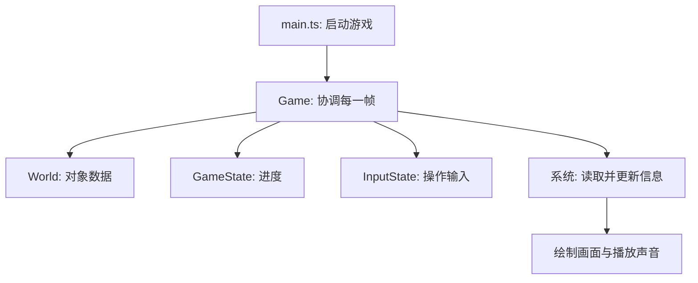
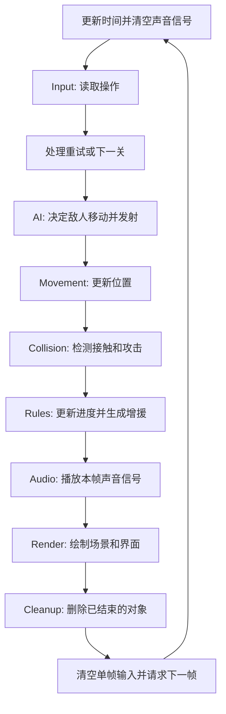
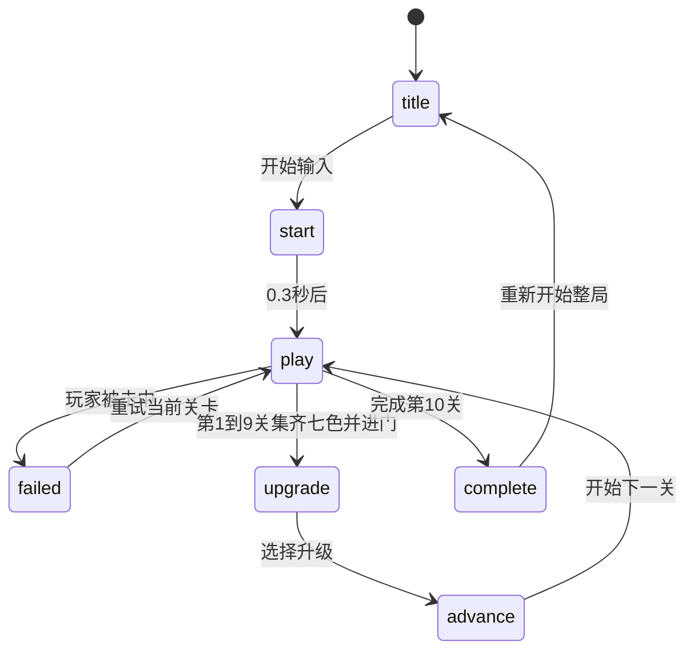

# 游戏代码如何运作

[🇺🇸 English](../../ARCHITECTURE.md) | [🇰🇷 한국어](../ko/ARCHITECTURE.md) | [🇯🇵 日本語](../ja/ARCHITECTURE.md) | [🇨🇳 简体中文](ARCHITECTURE.md)

这个游戏把**游戏对象、对象的数据、处理数据的代码**分开管理。这种组织方式叫ECS，即Entity、Component、System。

可以把它理解为几份共享列表。一份保存位置，另一份保存移动速度。不同的处理代码更新这些列表，再把结果画到屏幕上。

## 1. 用一个简单例子理解ECS

假设有一只独角兽和一颗火球：

| 对象ID | 类型 | 位置 | 移动 |
|---|---|---|---|
| 0 | 独角兽 | x: 100, y: 200 | 向右260px/s |
| 1 | 火球 | x: 400, y: 200 | 向左250px/s |

这些只是示例数值，不是实际起始位置。

两者都需要移动。与其为不同类型分别编写移动代码，不如让同一个处理过程读取位置和速度，再移动两者。

| 术语 | 简单含义 | 游戏中的例子 |
|---|---|---|
| Entity | 对象的ID编号 | 标识独角兽、敌人或子弹的编号 |
| Component | 对象的一项信息 | 位置、速度、生命值、剩余寿命 |
| System | 负责一组工作的代码 | 移动、碰撞检测、画面绘制 |

**实体不会自己移动，而是系统修改它的位置数据。**

## 2. World保存对象的信息

`World`是这些列表的共享容器。代码使用JavaScript的`Map`，通过ID查找对应值：

```ts
// 读取这个对象的位置。
const position = world.positions.get(entity);
// 读取它的移动速度。
const velocity = world.velocities.get(entity);
```

`Set`只保存ID，不附带其他数据。例如，`world.players`标记哪个对象是玩家。这种分类成员关系称为**标签**。

`spawnPlayer()`创建一个ID，再附上所需信息来生成玩家：

```ts
const entity = world.createEntity();
world.positions.set(entity, {x: 1600, y: 1100});
world.velocities.set(entity, {x: 0, y: 0});
world.facings.set(entity, {x: 1, y: 0});
world.cooldowns.set(entity, {value: 0});
world.radii.set(entity, {value: 11});
world.players.add(entity);
```

facing表示朝向，cooldown表示等待计时器，radius表示碰撞圆的半径。敌人也用同样的方式创建，只是使用敌人类型和生命值数据，而不是玩家标签。这些生成函数位于`src/prefabs.ts`。

TypeScript帮助检查数据的结构。专门的`Entity`类型也有助于在编写代码时区分对象ID与普通数字。

## 3. Game负责协调全局

需要区分三个重要容器：

| 容器 | 保存什么 | 例子 |
|---|---|---|
| `World` | 单个对象的信息 | 一个敌人的位置和生命值 |
| `GameState` | 整局游戏的进度 | 当前关卡、收集颜色、升级、总时间 |
| `InputState` | 用户当前的输入 | 持续按右键、刚按下攻击、摇杆方向 |

`Game`持有这些容器，并按顺序调用系统。`main.ts`创建Game，再让浏览器开始运行帧。



## 4. 按下右方向键后会发生什么

**帧**是对游戏和画面的一次更新。浏览器通过`requestAnimationFrame`反复调用`Game.frame()`。

1. `InputState`记住右方向键被按住。
2. `InputSystem`把独角兽的移动方向设为向右。
3. `MovementSystem`根据速度改变位置。
4. `CollisionSystem`检查新位置是否碰到了什么。
5. `RulesSystem`在需要时更新游戏进度。
6. `RenderSystem`读取位置，把独角兽画在那里。

移动使用距离上一帧经过的时间：

```text
新位置 = 原位置 + 速度 × 经过的秒数
```

以260px/s移动，0.01秒就前进2.6px。保存的位置可以有小数，但绘制时会取整，让图像保持清晰。

## 5. 一帧内的工作顺序



| 系统 | 回答的问题 |
|---|---|
| `InputSystem` | 玩家想做什么？ |
| `AISystem` | 敌人该去哪里？ 是否该发射了？ |
| `MovementSystem` | 移动对象现在在哪里？ |
| `CollisionSystem` | 什么碰到了什么？ 攻击命中了谁？ |
| `RulesSystem` | 是否失败、开门或通关？ 是否该增援？ |
| `AudioSystem` | 应播放哪些声音？ |
| `RenderSystem` | 玩家应看到什么？ |
| `CleanupSystem` | 哪些对象应删除？ |

有些系统承担多项相关工作：AI还会发射独角兽的自动闪电，Collision也负责波动的击退。研究某个行为时，应阅读实际函数，而不只是根据系统名称判断。

顺序会影响结果。AI生成的子弹可以在同一帧移动并命中。较晚在Rules中生成的敌人会立即显示，但从下一帧才开始AI移动。

## 6. 收集棱镜后会发生什么

再用一个例子跟踪处理过程：

1. **Collision**检测独角兽与棱镜重叠，报告棱镜颜色。
2. **Rules**把颜色加入已收集集合并增加数量。
3. **Audio**根据Game从碰撞结果设置的信号播放收集音。
4. **Render**绘制更新后的颜色显示。
5. **Cleanup**删除已收集的棱镜。

解锁Rainbow Wave后，棱镜不会立刻消失，而是变成临时波动。它保留颜色，移动到发动位置，并获得0.6秒寿命。Collision应用击退，Render绘制扩张的圆，寿命结束后Cleanup将其删除。

绘图代码不决定是否收集成功，而是显示其他系统已经计算好的结果。

## 7. 如何安全地删除对象

被击败的敌人或寿命结束的子弹通常会加入`world.consumed`，意思是**删除这个对象**。

帧结束时，CleanupSystem调用`World.destroyEntity()`，从所有已注册列表中删除这个ID，包括位置、速度和冷却时间。只删除图像会留下看不见的游戏数据。

关卡开始时，`World.clear()`会清空对象列表并重置ID计数器。ID之后会被复用，所以不能把下一关的相同编号当成原来的对象。

## 8. 状态控制画面和关卡

`GameState.phase`表示当前处于标题、游玩、升级选择、失败或完成状态。另外还有两个短暂的过渡状态。



Game中有三个主要切换函数：

| 函数 | 作用 |
|---|---|
| `reset()` | 创建新的一局并显示标题 |
| `startStage()` | 替换场景对象，重置关卡内进度 |
| `nextStage()` | 增加关卡编号并调用startStage |

重试会保留升级和总游玩时间，整局重置则会清空它们。每关开始时有一秒免伤时间。

总时间在游玩中增加，也包括失败尝试；在升级和失败画面中暂停。完成当前关卡的时间等于总时间减去此前已完成关卡的时间。

阅读代码时还需注意两点：

- 一帧最多推进0.05秒。因此浏览器长时间卡住时，不会把全部现实时间计入。
- 暂停由各系统内部处理。Movement在非游玩阶段也运行，因此仍有速度的敌人或子弹可能在遮罩后移动，但碰撞游戏逻辑和主计时器已暂停。

## 9. 从哪里开始阅读

```text
src/
  main.ts                 启动游戏
  game.ts                 执行帧并切换关卡
  state.ts                定义进度和设置
  input.ts                保存键盘和触屏输入
  prefabs.ts              创建游戏对象
  ecs/
    entity.ts             定义对象ID
    component.ts          定义数据列表类型
    world.ts              保存并清理列表
  systems/                移动、AI、碰撞、规则、音频、绘图
  assets/                 角色和传送门图片

tools/
  build-game.mjs          将游戏合并为一个HTML文件
  build-zip.mjs           生成提交ZIP
  build-dashboard.mjs     生成本地检查面板
```

推荐按**prefabs → World → Game.frame → Movement → Collision → Rules → Render**阅读。选择棱镜这样的单个对象，跟踪它在各文件中的处理。

构建会合并源代码、删除开发专用代码、缩短内部名称，再把WebP嵌入index.html。ZIP中包含这个HTML。上面的目录结构服务于开发，并不会原样出现在提交ZIP中。

图片、动画、声音和敌人移动的制作方式见[TECHNIQUES.md](TECHNIQUES.md)。
